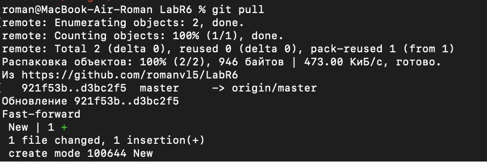
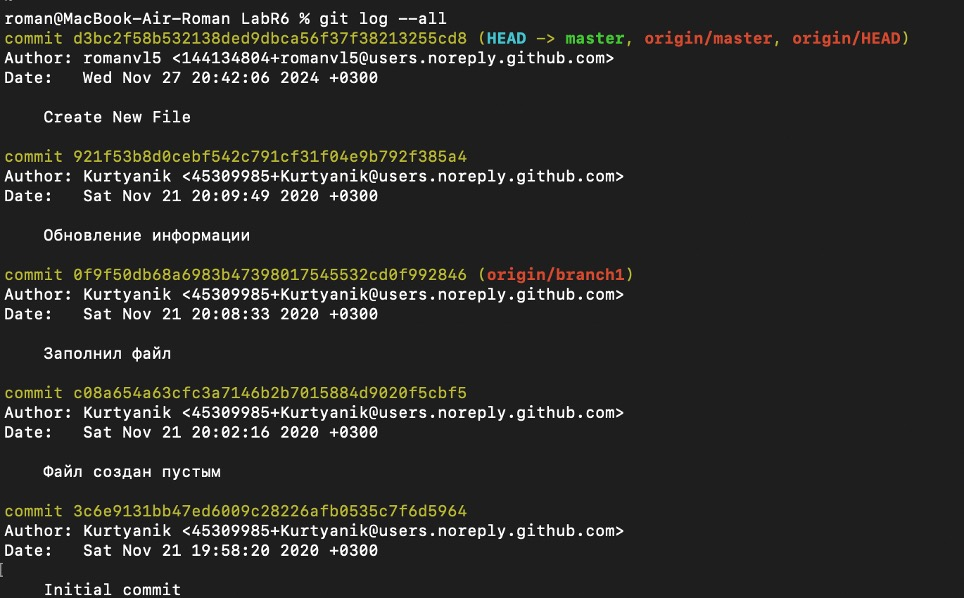
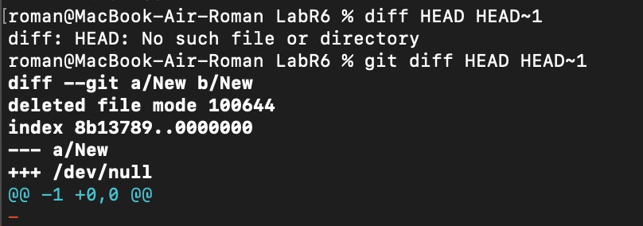
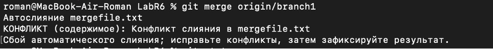
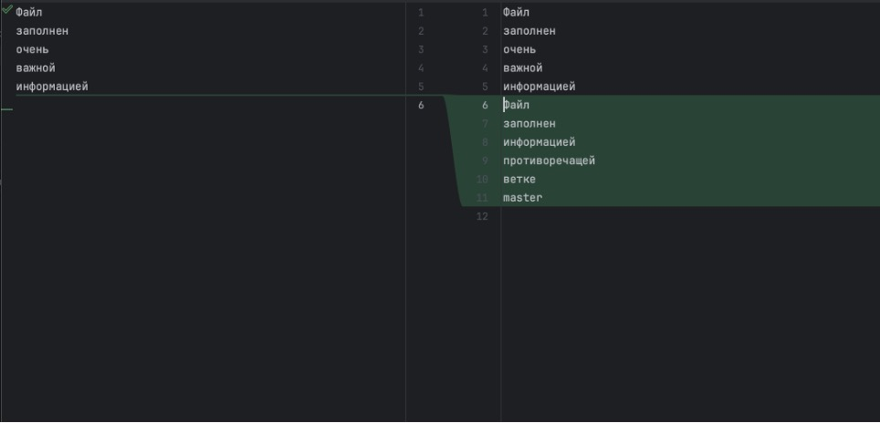
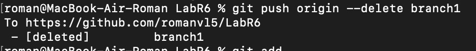
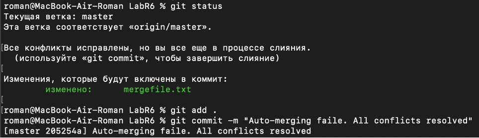
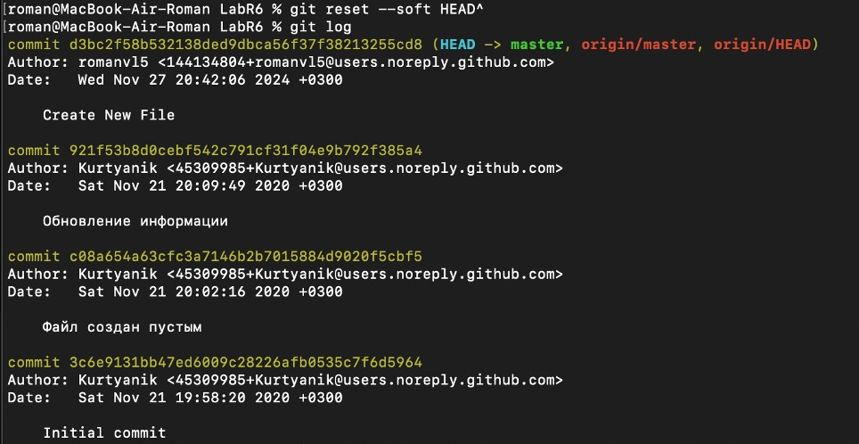
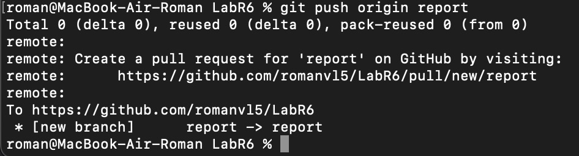
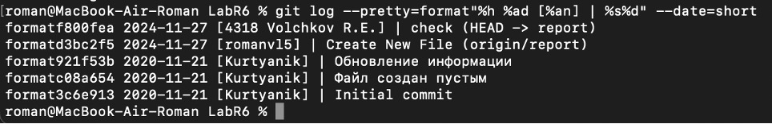

# Лабораторная работа №6

## Цель лабораторной работы 

Изучение базовых возможностей системы управления версиями, опыт работы с Git Api, опыт работы с локальным и удаленным репозиторием.

---

## Ход выполнения лабораторной работы

### 1. Создание форка, настройка git и клонирование личного репозитория
На GitHub уже был создан аккаунт. 
Сделана копия в личное хранилище из https://github.com/Kurtyanik/LR6 (форк).  

Установлен и настроен
клиент Git для работы с репозиториями.
Был выполнен процесс клонирования личного удалённого репозитория на локальный компьютер.

Скриншот:  


**Рисунок 1** — Клонирование репозитория.

---

### 2. Добавлен файл через интерфейс GitHub. Подтянуты изменения в локальный репозиторий
Был добавлен новый файл в репозиторий через интерфейс GitHub. 

После добавления файла изменения были подтянуты в локальный репозиторий.  

Скриншот:



**Рисунок 2** — Добавление файла.

---

### 3. Получена история оперций для каждой из веток
Была получена история операций для каждой из веток в репозитории.  

Скриншот:



**Рисунок 3** — История оперций.

---

### 4. Просмотр последних изменений
Выполнен просмотр последних изменений в проекте.  

Скриншот:



**Рисунок 4** — Последние изменения.

---

### 5. Выполнено слияние в ветку master
Начало слияния в ветку master. Наличие конфликта.  

Скриншот:  



**Рисунок 5** — Слияние.

---

### 6. Разрешение конфликта
Решение конфликта при merge с помощью редактора CLion. Два файла объединены в один.
 
Скриношоты:


**Рисунок 6** — Решение конфликта.

---

### 7. Удалена побочная ветка
Удаление побочной ветки.

Скриншот:



**Рисунок 7** — Удаление побочной ветки.

---

### 8. Сделаны изменения и зафиксированы.
Сделаны изменения и зафиксированы.

Скриншот:



**Рисунок 8** — Изменения и фиксация.

---

### 9. Откат коммита.
Сделан откат коммита.

Скриншот:



**Рисунок 9** — Откат коммита.

---

### 10. Создана ветка для отчёта.
Создание ветки для отчета.

Скриншот: 



**Рисунок 10** — Ветка для отчета.

---

### 11. Логи команд:

```
git clone - клонирует удаленный репозиторий в локальный
git config - настройка конфигурации
git log - отображает все коммиты
git status - отображает состояние файлов
git branch - отображает все ветки
git merge - выполняет слияние веток
git add - добавляет изменения в index
git commit - создает коммит (фиксирует изменения, можно добавить комментарий)
git push - отправляет коммиты в удаленный репозиторий
--global - настройка применяется ко всем репозиториям Git на этом компьютере для текущего пользователя
```
### 12. История операций в форматированном виде.

Скриншот:



**Рисунок 11** — Историю операций

### Вывод

В ходе выполнения лабораторной работы были изучены базовые 
возможностеи системы управления версиями,
работа с Git Api, работа с локальным и удаленным репозиторием.


